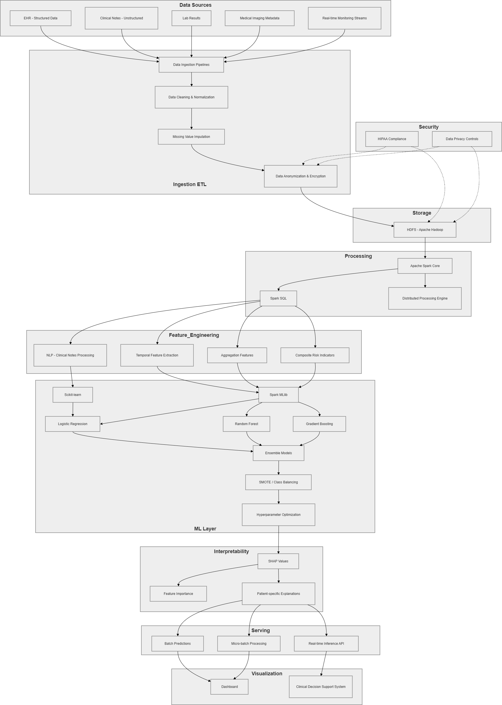

# Big Data Analytics Approach for Predictive Healthcare

An end-to-end distributed machine learning pipeline built with Apache Spark to predict Cardiovascular Disease (CVD) risk. This project demonstrates how to scale healthcare predictive analytics while maintaining model interpretability using SHAP (SHapley Additive exPlanations).

## 📖 Project Overview

The rapid growth of healthcare data from electronic health records, lab systems, and medical devices has created a critical need for scalable analytical solutions. Traditional single-node data processing methods often struggle with large, heterogeneous datasets, limiting their effectiveness in early disease detection. 

This project tackles these limitations by implementing a distributed analytics framework. Focusing on cardiovascular disease risk assessment, the pipeline integrates structured data, performs rigorous feature engineering, and trains ensemble machine learning models. 

**Key Contribution:** Unlike many predictive healthcare solutions that operate as opaque "black boxes," this project integrates SHAP values to provide transparent, feature-level explanations for individual risk predictions.

## 🏗️ System Architecture

*(Note: Upload your architecture diagram to the repository and ensure the image name matches the link below, e.g., `architecture_diagram.png`)*



The architecture is designed for a distributed Hadoop/Spark environment, decoupled into the following operational layers:
1. **Ingestion ETL:** Cleaning and handling missing values.
2. **Processing (Feature Engineering):** Deriving interaction terms and age-group bucketizing.
3. **ML Layer:** Training Logistic Regression and Random Forest models on scaled, vectorized features.
4. **Serving Layer:** Batch scoring pipelines and a real-time inferencing API.

## 📂 Repository Structure

```text
├── src/
│   ├── 1_ingestion_etl.py                 # Data cleaning and imputation
│   ├── 2_feature_engineering.py           # Deriving clinical features
│   ├── 3_model_training.py                # Model training and saving to disk
│   ├── 4_batch_scoring.py                 # Generating predictions on unseen data
├── requirements.txt                       # Python dependencies                             
└── README.md
